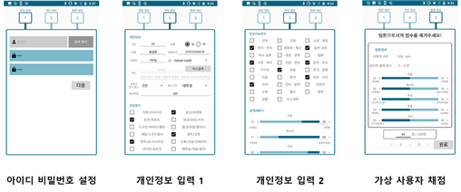
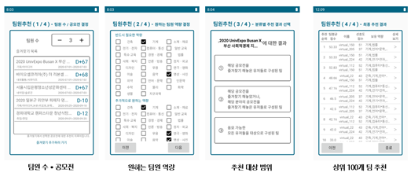
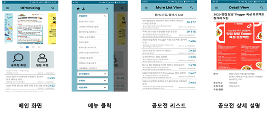

<p>
    <h1 align="center">
            공모전 팀원 추천 어플
    </h1>
</p>

<p align="center">
    <a href="https://travis-ci.org/steverichey/google-play-badge-svg">
        
    </a>
    <a href="./license.md">
        
    </a>
</p>

<p align="center">
  • <a href="#about">About</a>
  • <a href="#screen-shot">Screen shot</a>
  • <a href="#Team">Team</a>
  • <a href="#license">License</a>
</p>


## About

공모전 참여를 할 때 본인이 원하는 사람과 가장 비슷한 팀원을 추천해주는 어플리케이션입니다.

- 팀원 추천
  - 참여할 공모전에 대하여 원하는 사람과 가장 비슷한 팀원을 추천해줍니다.
  - 여러 팀원이 추천이 되고 그중 원하는 팀원을 선택할 수 있습니다.

- 공모전 검색
  - 현재 열리고있는 공모전들을 카테고리 별로 검색을 할 수 있습니다.

- 즐겨찾기
  - 관심있는 공모전을 즐겨찾기 할 수 있습니다.


## Screen shot
<p align="center">
        <br><br>
        <br><br>
        <br>
</p>


## Team

- 2015136119 정현석 (Recommendation Algorithm, Machine Learning)
- 2015136072 안태영 (Recommendation Algorithm, Machine Learning)
- 2015136067 신한철 (Android, PHP)
- 2015136131 최승용 (Android, PHP)

## License

```
Copyright 2020 Hancheol Shin

Licensed under the Apache License, Version 2.0 (the "License");
you may not use this file except in compliance with the License.
You may obtain a copy of the License at

    http://www.apache.org/licenses/LICENSE-2.0

Unless required by applicable law or agreed to in writing, software
distributed under the License is distributed on an "AS IS" BASIS,
WITHOUT WARRANTIES OR CONDITIONS OF ANY KIND, either express or implied.
See the License for the specific language governing permissions and
limitations under the License.
```
